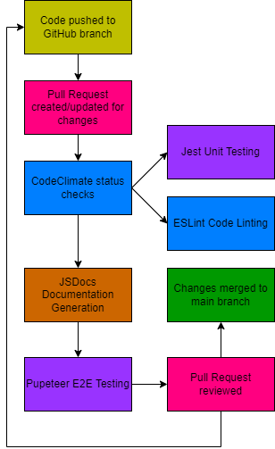

# CI/CD Pipeline - Phase 1

## Code Linting
Code linting is the process of analyzing code for potential errors, bugs, stylistic inconsistencies, and other issues without executing the code. This helps in improving code quality, readability, and maintainability. We considered a plethora of linting tools to ensure a consistent style throughout our code including CodeClimate, ESLint, TypeScript, and standard JavaScript automated via a package.json file. Due to the fact that we are using CodeClimate already for code quality assurance and its ease in GitHub integration, we decided to use it to handle our linting processes as well, which are easily configurable via a YML file. However, in terms of the linting itself, we mainly incorporated ESLint, alongside CSSLint and MarkdownLint, into CodeClimate for use. 

ESLint is a code analysis tool for identifying “problematic patterns” in javascript code when we create pull requests. The base functionality has been created but has not been tested nor properly implemented with regards to our project. Considering little actual coding has been completed in our project, there isn’t much to do other than set up basic dummy tests to show that it works properly with code. However, later on when we are implementing functional components of our website, we plan on using ESLint to thoroughly review the many different JS files we plan on creating in our repository. For future reference, an existing online demonstration of its functionality can be found here.

## Code Quality
### Tool-Based
For our code quality assurance, we tested out various tools such as CodeClimate, Codacy, SonarCloud, and DeepSource while weighing the pros and cons of each tool against one another. One thing that was important to us was how well these tools would be integrated with our GitHub pull request actions, as we wanted to make the work of our human review system as efficient as possible. 

With this in mind, we have currently integrated CodeClimate into our working repository in order to adhere to a clean quality checking experience. With CodeClimate, we are able to look at factors such as number of files checked, test coverage, and many more features that we feel will be of use in the future.

### Human Review
In order to ensure that all deployed code is up to standard, we have been and will continue to integrate a system of working on work via branches dedicated to a particular task, to which then will be reviewed by a team lead to be merged into the main branch via Pull Request.

## Unit Testing
We plan to use Jest to create unit tests, then we then incorporate the tests into github action by editing the yaml. When the developer pushes the code, the unit tests will automatically run as part of the build process. The pipeline will fail if any of the tests fail, indicating that there are issues with the code changes. By using Jest, we can provide rapid feedback to developers and maintain code quality throughout the development process.

## Documentation
As far as automated documentation, we considered JSDocs, TypeScript, Documentation.js, and manual documentation via standard JS that would be placed into a package.json file. We decided to use JSDocs, which allows for efficient code tracking in JavaScript. One of its main benefits is that it supports special JSDoc tags to keep track of more important code such as a function’s return type, its arguments, and more.

## End-to-end testing
For end-to-end testing, we decided on Puppeteer due to the team’s previous experience with the tool. Puppeteer allows us to individually check each action a user can take with the web page to ensure that it is doing what we expect it to do.